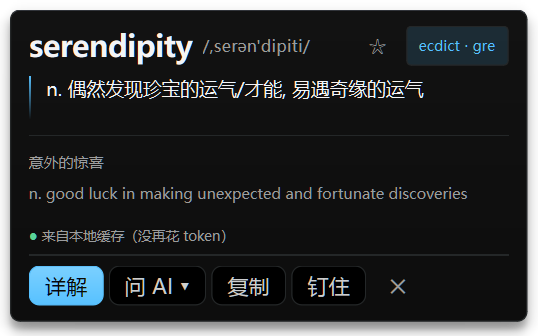
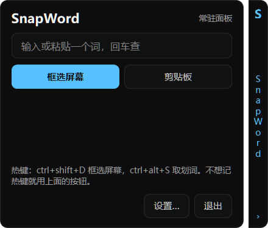

# SnapWord · 屏幕查词

**v0.1.0beta** · [github.com/ExpertKT/SnapWord](https://github.com/ExpertKT/SnapWord)

屏幕上看到不认识的词 → 框一下 → 卡片就出来。挂着常驻、不抢焦点。

**[⬇ 下载 v0.1.0beta](https://github.com/ExpertKT/SnapWord/releases/latest)**（5 MB 自举包：解压 → `setup.cmd` → `SnapWord.cmd`）；
下面的「跑起来」是同一件事的手动版。



## 跑起来

```bat
:: 1. 依赖（PySide6 一个包就够）
python -m venv .venv
.venv\Scripts\python.exe -m pip install --no-cache-dir ^
    --index-url https://mirrors.aliyun.com/pypi/simple "PySide6-Essentials>=6.11"

:: 2. 离线词库（182 MB）
.venv\Scripts\python.exe tools\fetch_dict.py

:: 3. OCR 模型（快模型 5 MB；想更准再下大模型，见 docs\OCR-NOTES.md）
.venv\Scripts\python.exe tools\fetch_ocr_model.py
.venv\Scripts\python.exe tools\fetch_ocr_model.py --model ppocrv5-server

:: 4. OCR helper（仓库里带了编好的 ocr-helper.exe，改了源码才需要重编）
powershell -ExecutionPolicy Bypass -File helper\build-ocr.ps1

:: 5. 启动
双击「启动 SnapWord.cmd」     :: 也可以 .venv\Scripts\python.exe -m snapword.cli gui
```

要求：Windows 10/11 x64 + Python 3.10+（自带 `csc.exe` 或 .NET Framework 4 就能编 helper）。
`PySide6-Essentials` 选 6.11 以上是因为旧的装不上 Python 3.14。

## 释义从哪来（**以词典 / 有道为准，LLM 只负责展开**）

1. **离线词典 ECDICT**（`data\ecdict.db`，77 万条）—— 快路径主力，零延迟零 token
2. **有道免费接口**（`aidemo.youdao.com/trans`）—— 离线没命中时顶上；命中了就作为对照补一行
3. **百度翻译**（可选，要自己去 `fanyi-api.baidu.com` 免费领 appid + 密钥）—— 有道也不给结果时的第三家
4. **本地 9B**（Ollama `qwen3.5:9b`）—— 免费出初稿、答疑、整理格式
5. **DeepSeek**（可选，要 key）—— 只在「必须准且详细」的那一问才用

## 三条硬要求怎么落实的

| 要求 | 做法 |
| --- | --- |
| 不抢焦点 | 卡片是 `Qt.Tool + WA_ShowWithoutActivating`，`show()` 之后**不调用** `activateWindow()`；只有你自己点「问 AI」才把键盘交过去 |
| 快 | 热键按下**先抓整屏**（所以遮罩不会拍到自己），词典结果直接在本地出（查一次 ~0.1 ms）；联网和 LLM 全在后台线程 |
| 省 token | 结果按词进 `data\cache.db`，同一个词只查一次；DeepSeek 只在你点「详细解释」或按住 Shift 提问时才发 |

| 热键 | 作用 |
| --- | --- |
| `Ctrl+Alt+Q` | 拖框取词（默认；`Ctrl+Alt+D`、`Ctrl+Alt+W` 在这台机器上已被别的软件占用） |
| `Ctrl+Alt+S` | 取划词 —— 模拟 Ctrl+C；在控制台窗口里自动让路给拖框（Ctrl+C 会打断进程） |
| `Esc` | 关掉卡片（只在卡片开着的时候才抢全局 Esc） |

热键被占用时不报错也不弹框，会**自动换一个能用的**并在托盘气泡里告诉你换成了哪个。
想固定就改 `config.json` 里的 `hotkey`（备选链见 `gui.run`）。

### 完全不想记热键？用右边那条边

起来之后屏幕右边缘会贴着一条 26px 的细边（<kbd>S</kbd>），点一下就展开面板：
输入框手打一个词回车、或者点「框选屏幕」「剪贴板」——**跟热键是同一套功能，一个热键都不用记**。



- 点细边 = 展开 / 收起（180ms 滑出动画）；**按住细边上下拖 = 挪位置**；位置、展开状态都记进 `config.json`
- 展开时会自动把焦点放进输入框（方便直接打字）；收起、以及卡片弹出时都不抢焦点
- 面板是**贴死屏幕右边缘**的（`EDGE_GAP = 0`），**默认挂主屏**；挂哪块屏在设置里选，或在托盘菜单
  「面板挂在哪块屏」里换（主屏 / 各副屏都列出来，换完立刻生效）
- 托盘图标右键也有：**显示常驻面板**（勾选框）、**展开 / 收起面板**、面板挂在哪块屏
- 不想要这条边：设置里取消勾选、托盘菜单取消勾选，或把 `config.json` 里 `dock.enabled` 改成 `false`

动画都走 `docs/UI-STYLE.md` 里定死的那张表：面板展开/收起 180ms、卡片淡入上滑 180ms、
卡片关闭淡出 120ms、卡片长高 160ms（展开动画只动 x，窗口宽度恒定，所以细边全程可见，
不用裁剪也不会闪）。

### 就这个词追问（问 AI）

卡片上的「问 AI」会在卡片里开一个小对话窗，**流式**出字 —— 不用等整段憋完，字一点点冒出来：


谁来答：**本地 9B 优先**（免费、不花 token、不联网）；本地 Ollama 没在跑的时候
**自动改用 DeepSeek**（填了 key 就管用）—— 所以没装本地模型的机器上也照样能问答。
想强制走 DeepSeek：按住 `Shift` 点「发送」。两边都没配时不会静默失败，气泡里会直说该去哪儿填。

同一张卡片里的追问带上下文（最近 8 条），换个词查就清空。提问前会先探一下
`/api/tags`，模型不在跑就直接转网，不至于让你对着空气等一个 180 秒的超时。

命令行也能单独用（排查问题时最方便）：

```bat
python -m snapword.cli probe          :: OCR helper 通不通
python -m snapword.cli ocr 图片.png    :: 只识别
python -m snapword.cli look serendipity --detail
python -m snapword.cli look running --no-net
python -m snapword.cli ask serendipity "它和 luck 的区别？"
```

## 目录

```
src\snapword\
  cli.py        命令行入口
  gui.py        悬浮卡片 + 屏幕右边缘的常驻面板（PySide6）：热键、框选遮罩、卡片、托盘、设置
  lookup.py     查词管线：快路径 → 慢路径 → 答疑
  ecdict.py     离线词典（含粗糙但够用的词形还原）
  providers.py  Ollama / DeepSeek / 有道 / MyMemory（只用标准库 urllib）
  ocr.py        调 helper\ocr-helper.exe
  cache.py      按词缓存（SQLite）
  winput.py     全局热键、SendInput 发 Ctrl+C、前台窗口类名（纯 ctypes）
  config.py     config.json 的默认值与读写
helper\         OCR helper（C# 编译的单文件 exe）+ 构建脚本 + helper\src\（vendored 的 C# 源码）
models\         OCR 模型（不提交，用下面那个脚本下）
tools\fetch_dict.py   下 182 MB 的离线词库（走 npm 镜像，1.5 秒）
tools\fetch_ocr_model.py  下 OCR 模型（快模型 5MB 秒下；--model ppocrv5-server 是那 165MB 的准模型）
tools\ocr_bench.py    OCR 识别能力的自迭代测试台（判定 + 归因 + 报告）
tools\ocr_audit.py    OCR 失败反思：把失败条目交给本地 9B 说病因/下一步（不用联网）
tests\test_core.py    裸断言，无框架：python tests\test_core.py
docs\          截图 + UI-STYLE.md（配色令牌/动效）+ OCR-NOTES.md（识别实测记录）
```

OCR 是**复用 SnapWheel 的 C# 源码**编出来的 `helper\ocr-helper.exe`，两个引擎 + 两套模型：

- `system` Windows 自带的 WinRT OCR：**拉丁强**（小字英文全认对）、快（~60-190ms）、
  永远可用，但 9~12px 的中文会认成形近错字（`屏幕查词` → `屏墓查词`）。
- `native` 本地 PP-OCR（`lw.OpenCVDNN.PPOCR.dll`），模型档位可以换（**换模型 = 换目录**，
  DLL 按 `*det*.onnx` / `*rec*.onnx` / `*dict*.txt` 自己找）：
  - **tiny（PP-OCRv6，默认）**：快（~94ms），中文强、小字/细长拉丁会把文字框切错
    （`serendipity` → `sereridipity`、`idipity⏎C`）→ 语料通过 10/16。
  - **PP-OCRv5 server（165MB）**：准得多，上面那些全部读对 → 通过 **15/16**，
    但一次调用 **1.2s**（helper 一个进程一次调用，每次都要重新加载 165MB 模型）。
    下它：`python tools\fetch_ocr_model.py --model ppocrv5-server`（走 ModelScope，~5 MB/s，半分钟）

**`auto`（默认）走"便宜在前"的阶梯**：`native+tiny` → 分数不够 → `native+v5server` →
`system`，谁分高用谁（分数由离线词典算，见下）。所以**普通词 ~60-90ms 出结果，
tiny 读得可疑时才花那 1.2 秒** —— 实测难例 465/551ms。语料基准：native 单跑 10/16、
system 9/16、**`auto` 15/16**（唯一挂的是 `grep→qrep` 一个字母）。

**两个引擎互补，没有一个是够用的，所以重点是"谁来挑结果"。** 打分靠离线词典
（查得到才是硬信号，比长度靠谱 —— `sereridipity` 比正确答案还长）。完整实测矩阵、
打分明细、两次没做成的尝试都记在 `docs\OCR-NOTES.md`。

组件目录写在 `config.json` 的 `ocr_dir`（快模型）和 `ocr_dir_strong`（大模型）；
helper 只认环境变量 `SNAPWHEEL_OCR_DIR`，由 `ocr.py` 透传。两个目录不存在时逐级降级，
`ocr_dir_strong` 清空就等于只跑 tiny。

另外一个坑：**PP-OCR 的文字检测在"又宽又扁"的图上会失效** —— 同一批像素，整个窗口
（2578x1458）能读对整段，裁成 `1690x46` 一条就**只吐一两个汉字**（用户报的"只识别出一个
字母"）。所以 `helper\Program.cs` 在识别前会把宽高比压到 6:1 以内（上下补背景色），
JSON 里多打 `iw/ih/pw/ph` 告诉你补边前后的尺寸。这也是为什么**别把 helper 换回旧版**。
实测记录见 `docs\OCR-NOTES.md` 第 7 节。

`helper\build-ocr.ps1` 直接编译 `helper\src\` 下那三个 C# 文件（从 SnapWheel 仓库 vendored 过来的），
不用装 Visual Studio —— 用系统自带的 csc.exe。想编别的副本就 `-SrcDir <路径>`。

## 自检（改完代码跑这几条）

```bat
F:\SnapWord\.venv\Scripts\python.exe F:\SnapWord\tests\test_core.py   :: 23 个裸断言

:: 让 GUI 自己弹一张卡片，把卡片渲染成 PNG 后退出 —— 不用手动点，也不抓屏
set SNAPWORD_DEMO=serendipity & set SNAPWORD_SHOT=F:\SnapWord\tmp\card.png
python -m snapword.cli gui

:: 连 OCR 一起走：造一张写着这个词的图，喂给"框选完"那一步
set SNAPWORD_DEMO=ocr:quixotic & set SNAPWORD_SHOT=F:\SnapWord\tmp\card.png
python -m snapword.cli gui

:: 右边那条边：dock = 收起状态，dock-expanded = 展开状态
set SNAPWORD_DEMO=dock-expanded & set SNAPWORD_SHOT=F:\SnapWord\tmp\dock.png
python -m snapword.cli gui

:: 在卡片里真发一句追问（看流式），问题用 SNAPWORD_ASK 换
set SNAPWORD_DEMO=chat:serendipity & set SNAPWORD_ASK=它和 luck 有什么区别？
python -m snapword.cli gui

:: OCR 认得准不准：判定 + 归因 + 通过率，一次跑完（详见 docs\OCR-NOTES.md）
python tools\ocr_bench.py run            :: 加 --engine native 只看单个引擎
python tools\ocr_bench.py report         :: 看通过率随时间怎么变
python tools\ocr_audit.py                :: 失败的条目交给本地 9B 逐条说病因（不联网、不花 token）
```

两个 demo 都会把面板几何打出来（`右边缘=2048 屏右边缘=2048 贴边=True`），
**这条打印在 `_shot` 里而不是 `_demo_start` 里** —— 展开/收起是 180ms 动画，
早打印会读到动画中途的宽度（之前就被这个假象骗过一次）。

## OCR 认不准怎么办（自迭代测试台）

两个引擎**是互补的、而且各自都有稳定短板**：native（PP-OCR）中文准但会把小字/细长的拉丁词
**切框切错**（`serendipity` → `sereridipity`、`idipity⏎C`），系统 OCR 拉丁准但 9~12px 的中文
会认成形近错字（`屏幕查词` → `屏墓查词`）。所以重点是**谁来挑结果**，不是换引擎。

`auto` 现在的挑法：**用离线词典打分**（查得到才是硬信号，比长度靠谱 ——
`sereridipity` 比正确答案还长），native 先跑，分够高就收工，否则再跑系统、谁分高用谁。
首次基准：native 单跑 9/14、system 单跑 7/14、**`auto` 14/14**。

改完 OCR 就要跑一遍数据，而不是"看起来还行"：

```bat
python tools\ocr_bench.py collect 名字 --expect "正确文字"   :: 真框一块屏，存下那张图
python tools\ocr_bench.py run                              :: 判定 + 按错法归类 + 写报告
```

语料在 `data\ocr-bench\cases\`，历史在 `history.jsonl`，人看的报告是 `REPORT.md`。
**合成图会骗人**（一开始拿合成图自测全过，用户一框就出半截词），所以语料要真框。
失败会按"错成什么样"归成空 / 只有一个字 / 太短 / 截断 / 丢开头 / 中文错字 / 空格差 / 字符替换，
每一类都给出下一步该试什么。完整实测记录见 `docs\OCR-NOTES.md`。

### 「归类」之后的下一步，交给本机那个 9B 想

归类是**正则**做的（错成什么样 → 该试什么），它分不出「同一类错、不同原因」：
10px 的英文和 1690×46 的整行中文都会归到"截断"，但该试的东西完全不同。
所以还有一环 `tools\ocr_audit.py`：

```bat
python tools\ocr_audit.py              :: 把最近一次 run 的失败条目逐条喂给本地 qwen3.5:9b
python tools\ocr_audit.py --dry-run    :: 只打 prompt（调提示词用）
python tools\ocr_audit.py --limit 3 --engine native
```

它**完全本地**（打 `http://127.0.0.1:11434`，不联网、不花 token），逐条打印
`[i/n] 用例 期望→实得 / 病因 / 下一步`，产物是 `data\ocr-bench\AUDIT.md`
（每条跟着复现命令和这个用例最近几次的通过序列 `.x..`）。

**它说的话是假设，不是事实** —— 9B 会一本正经地编。验证手段仍然是 `ocr_bench.py run`
的通过率：AUDIT.md 里有「历次建议」表，上次照它做有没有用，对着通过序列看得很清楚。
没跑 Ollama 会直接提示 `ollama serve`，不会让你干等超时。

## 网络（这台机器上的实测值）

GitHub 在国内慢得没法用（`github.com` ~50 KB/s，`raw.githubusercontent.com` 20~200 KB/s 飘），
但 **npm 镜像快得离谱**：`registry.npmmirror.com` 实测 **41 MB/s**。
所以 182 MB 的离线词库走 npm 上的 `node-ecdict-sqlite-lastest` 包（见 `tools\fetch_dict.py`），
1.5 秒下完；ECDICT 仓库自带的 csv / release zip 那条路已经废弃，别回头。

## 配置 `config.json`

`hotkey` / `hotkey_selection` / `ocr_engine` / `ocr_dir` / `ocr_dir_strong` / `auto_detail` / `dock` / `providers.*`。
DeepSeek 的 key 填了才会启用（`enabled` 自动跟着 key 走）。GUI 里有「设置…」。
`dock` = `{enabled, expanded, y, screen}`，前三个都是你操作时自动写回去的（`y: null` = 竖直居中）；
`screen` 只在设置/托盘菜单里显式选屏时才写，`null` = 主屏（**别再改成"鼠标所在那块屏"** ——
鼠标在副屏时面板就跟着跑到副屏，用户报过这个）。

配色/圆角/间距/动效都定死在 `docs\UI-STYLE.md`（参考 Raycast 的 design tokens），
`gui.py` 顶部的 `T` 和 `DUR` 就是那张表的代码版；改样式先改文档再改 QSS。

## 已知限制

- 多显示器：抓图只抓鼠标所在那一块屏。
- `auto_detail` 默认关：详细解释要你点一下才生成，省钱。
- 崩了/卡片不出来：看 `data\snapword.log`。pythonw 启动时没有控制台，所以启动那行、
  未捕获异常、QThread 里的异常都写到那儿（启动器里已经装好这个钩子了）。
- 词形还原是后缀规则拼的，不是词典反查；查不到原形时靠 9B 兜底。
- 卡片弹出时 Qt 会往 stderr 打一行 `QWindowsWindow::setGeometry: Unable to set geometry ...`
  的警告（无边框 + 半透明背景的取整问题），不影响显示；用 pythonw 启动时看不到。
- 卡片和常驻面板是**分层窗口**（`WA_TranslucentBackground`），所以**截图工具/`grabWindow(0)`
  可能拍不到它们**（实测 `BitBlt` 直接漏掉）。画面上是正常的，别拿整屏截图判断它有没有显示；
  自检要用 `widget.grab()`。
